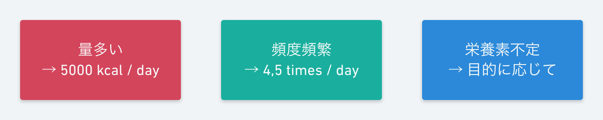
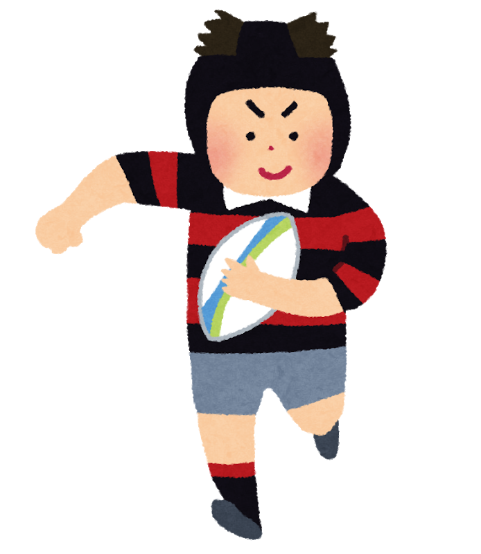
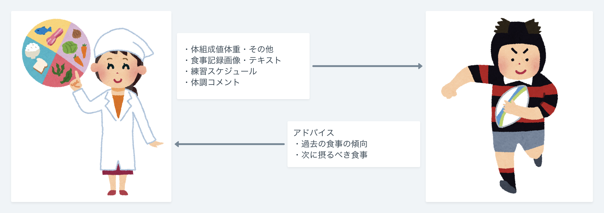

<!--
- アスリートの食事
- 管理栄養士の業務フロー
- 食事記録の課題
- インタビュー
-->

## 概要

FoodLog [1,2] は深層学習による食事画像認識技術を応用した食事記録サービス

<strong class="abstract-theme">
「FoodLogをアスリートの食生活の改善に使えないか?」
</strong>

  [1] S.Horiguchi, S.Amano, M.Ogawa, K.Aizawa, Personalized Classifier for Food Image Recognition, IEEE Trans. Multimedia Vol 20, No.10, pp.2836-2848, 2018.  
  [2] foo.log 株式会社, https://foo-log.co.jp/business-foodlog.html, 2019.

---

# 背景

---

## アスリートの食事は「特殊」で「自己管理が難しい」

<figure class="p80 athlete-food">
  
</figure>

  → 管理栄養士が**栄養指導**を行う

<!-- ---

## 「管理栄養士」がアスリートの食事指導を行う

<section class="dietitian-and-athlete-img-container">
  
  
</section> -->

---

## 管理栄養士の業務フロー

---

## 食事記録の課題

アスリートの<em>入力すべき情報が多い</em>

↓

アスリートが<em>入力をしない、入力を誤る</em>

↓

管理栄養士が<strong>適切なアドバイスを生成できない</strong>

