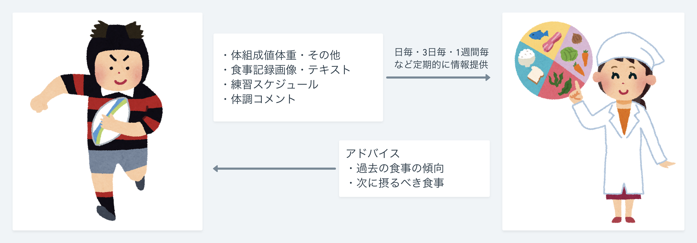

<!--
- アスリートの食事
- 管理栄養士の業務フロー
- 食事記録の課題
- インタビュー
-->

## アスリートの食事は「特殊」で「自己管理が難しい」

図1. 一般人の1日のエネルギー必要量とアスリートの1日のエネルギー必要量

|競技|必要エネルギー（男性）|必要エネルギー（女性）|
|:--|--:|--:|
|（18歳から29歳の平均）| 2650 kcal | 1950 kcal |
| 陸上短距離 | 2600 - 3300 kcal | 2300 - 2800 kcal |
| 水泳 | 3600 - 4600 kcal | 2400 - 3600 kcal |
| 野球・ソフトボール | 3400 - 4600 kcal | 2200 - 3400 kcal |
| ラグビー・アメフト | 4000 - 5000 kcal | - |

---

## 「管理栄養士」がアスリートの食事指導を行う

<section class="dietitian-and-athlete-img-container">
  
  
</section>

---

## 管理栄養士の業務フロー

---

## 食事記録の課題

アスリートの入力すべき情報が多い

<i class="fas fa-angle-double-down arrow-down"></i>

アスリートが入力をしない、入力を誤る

<i class="fas fa-angle-double-down arrow-down"></i>

管理栄養士が適切なアドバイスを生成できない

