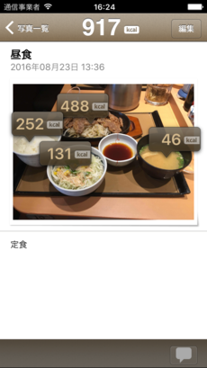
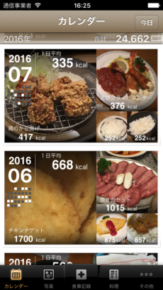
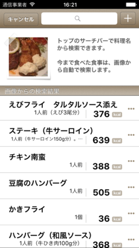
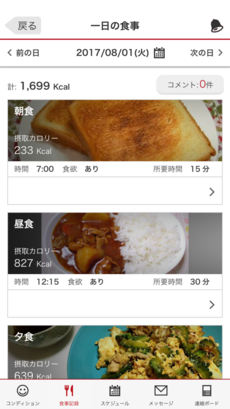
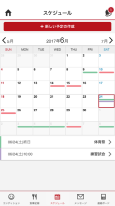
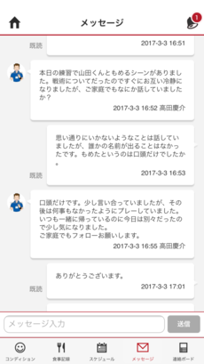
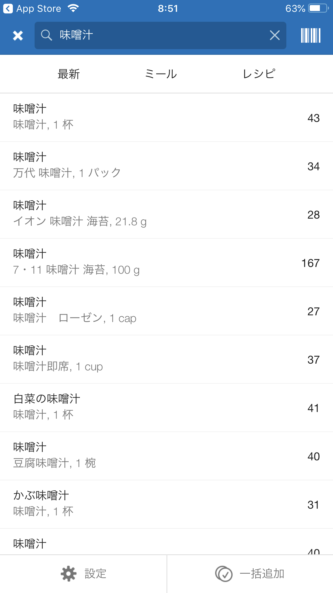
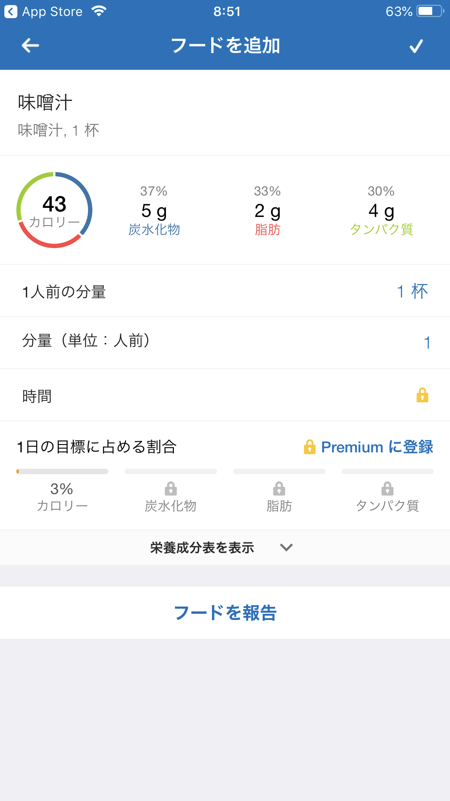
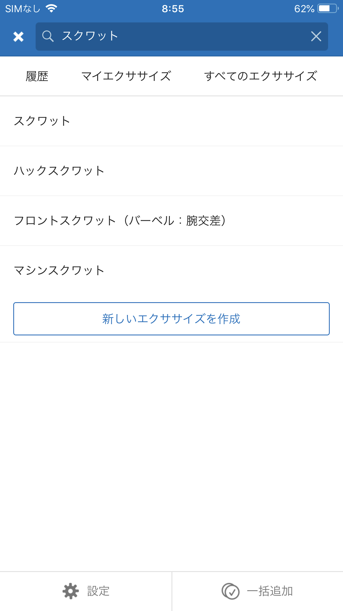
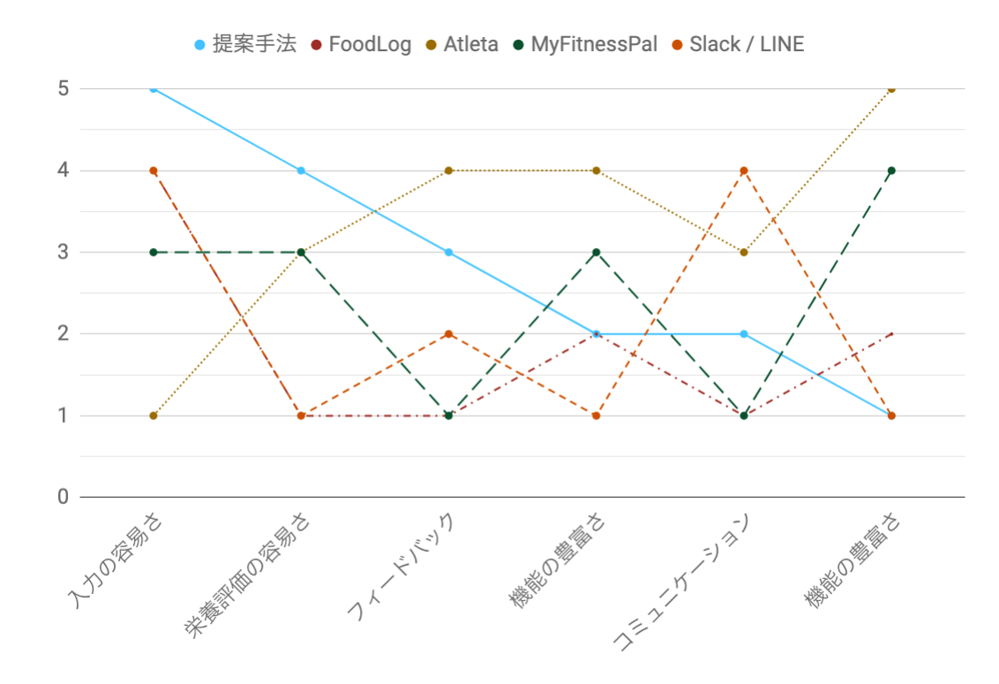

<!--
- FoodLog
- Atleta
- MyFitnessPal
- Slack / LINE
- まとめ
-->

<!-- transition: flip -->

# 関連研究

---

## FoodLog

毎日の食事を簡単に記録するためのモバイルアプリケーション
 
本システムでは食事認識の仕組みをAPIとして用いる

<section class="images">
  <figure>
    
    <figcaption>(a) 食事記録の認識結果</figcaption>
  </figure>
  <figure>
    
    <figcaption>(b) 食事記録に一覧画面</figcaption>
  </figure>
  <figure>
    
    <figcaption>(c) 食事記録の訂正画面</figcaption>
  </figure>
</section>

---

## Atleta

アスリートのコンディション管f理、食事管理、
 
指導者・選手間のコミュニケーション管理ができる

<section class="images">
  <figure>
    
    <figcaption>(a) 食事記録の一覧画面</figcaption>
  </figure>
  <figure>
    
    <figcaption>(b) 練習スケジュールの カレンダー画面</figcaption>
  </figure>
  <figure>
    
    <figcaption style="white-space:nowrap;">(c) 指導者とのメッセージ画面</figcaption>
  </figure>
</section>

---

## MyFitnessPal

アスリートや一般人が自身で栄養管理を行うためのアプリケーション
 
食事件数400万件・ユーザー1.5億人と世界で最も使用されている食事記録アプリ

<section class="images">
  <figure>
    
    <figcaption>(a) テキストによる食事の検索画面</figcaption>
  </figure>
  <figure>
    
    <figcaption>(b) 食事の詳細画面</figcaption>
  </figure>
  <figure>
    
    <figcaption>(c) 運動の登録画面</figcaption>
  </figure>
</section>

---

## Slack / LINE

現場ではこれが一番使われている
 
アスリートの手間は最小だが、管理栄養士が負担を強いられている

---

<figure class="big">
  
  <figcaption>種々のサービスの優劣(※ Freiの属性マップ)</figcaption>
</figure>
