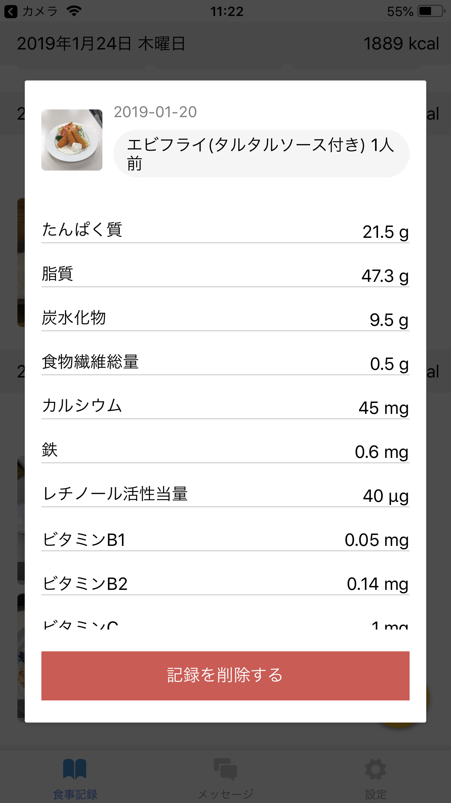

<!--
- 情報の流れ
- システムの概要
- システムの詳細
- アスリートのアプリケーション
- 管理栄養士のアプリケーション
-->

<!-- transition: flip -->

# 提案手法

<!-- ---

## 提案手法

アスリートと管理栄養士が行うコミュニケーションを
 
**食事画像の認識技術** を用いて簡易化 -->

---

## システムの情報の流れ

<figure>
  
</figure>

<!-- ---

## 実際のシステム構成要素

<figure>
  
</figure>

---

## 実際のシステム構成要素（詳細）

<figure>
  
</figure> -->

---

## アスリートのアプリケーションの要件

* 食事の写真を管理栄養士と共有できる
* その日に摂取したエネルギーを計算・表示できる
* 管理栄養士とメッセージのやり取りができる
* 食事製品の登録ができる

---

## 食事作成の手順

<figure>
  
</figure>

---

<video src="../images/create-record.mp4" controls>

<!-- ---

## 料理選択の3つの方法

* **食事画像** からの料理品目の推定
* **テキスト** による料理品目の検索
* **バーコード** による料理品目の検索 -->

---

## 食事記録の閲覧

<section class="horizontal-box">
  <figure>
    
    <figcaption>食事記録の一覧</figcaption>
  </figure>

  <figure>
    
    <figcaption>食事記録の詳細</figcaption>
  </figure>
</section>

---

## メッセージ

<section class="horizontal-box">
  <figure>
    
    <figcaption>メッセージ ①</figcaption>
  </figure>

  <figure>
    
    <figcaption>メッセージ ②</figcaption>
  </figure>
</section>

---

## 統計情報

<!--
TODO: MOVIE SCENARIO
- 体組成値の表示と登録
- 統計情報を増やしたい
-->

<section class="horizontal-box">
  <figure>
    
  </figure>

  

    <em>体重の登録</em>と表示ができる 
    表示できる統計情報を増やしたい
  

</section>

---

## 管理栄養士のアプリケーションの要件

- 数人から数十人のアスリートの情報（氏名・年齢・体組成値等）を参照できる
- アスリートの食事画像を見ながら栄養指導を作成できる
- コメントと食事をまとめてレポートを作成できる

---

## 管理栄養士側のWebアプリケーションの画面

<figure class="big">
  
</figure>

---

<figure class="full">
  
</figure>

<!-- ---

## 目標値の設定

<figure class="big">
  
</figure> -->

---

## アドバイスの作成

<figure class="big">
  
</figure>
