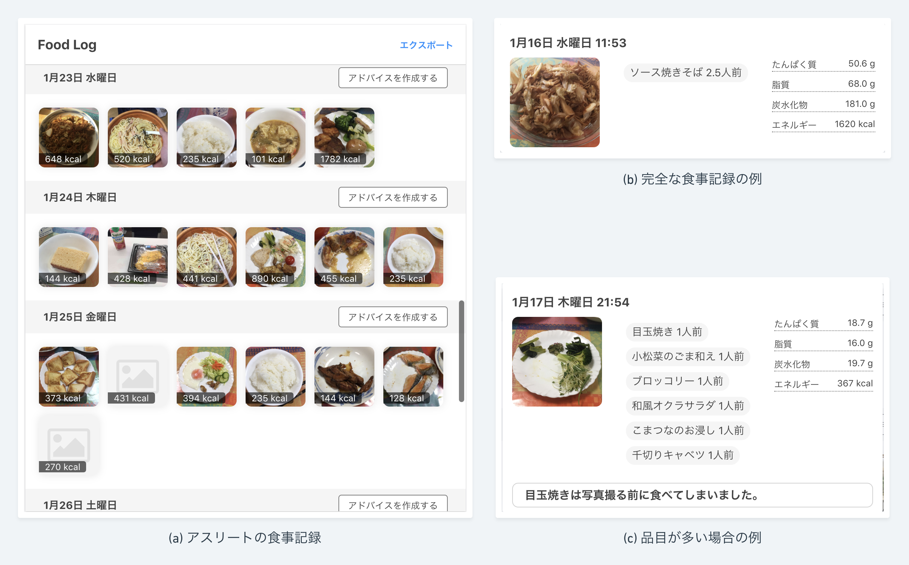
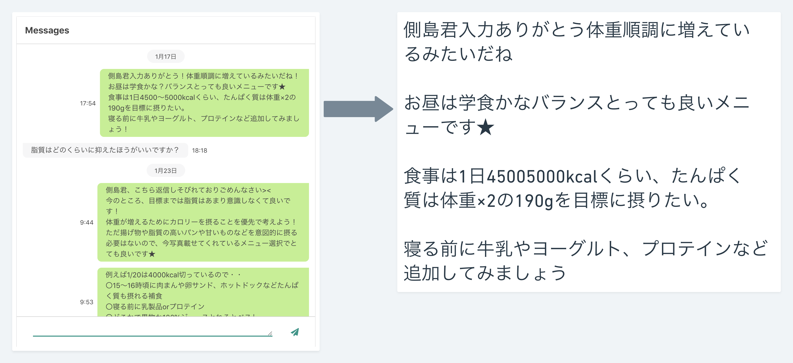

<!--
- ベータテスト
- 結果
- 本番利用
- 結果
- 実際の食事記録
- 実際のメッセージ
- 管理栄養士からの感想
-->

<!-- transition: flip -->

# 実験

---

## 実験の段階

* 試験利用（12月中旬〜12月末）
* **本番利用（1月中旬〜3月末）**

---

## 実験前提

**アスリート** 東京大学アメフト部 選手 10名
  
**管理栄養士** 株式会社ドーム 管理栄養士 1名
  
**時期** オフシーズンなので栄養指導の本番

---

## 結果: 食事記録の例

実験開始から2週間で約500件の食事記録が作成された

<figure>
  
  <figcaption>実際に作成された食事記録の例</figcaption>
</figure>

---

## 結果: メッセージの例

<figure class="big">
  
</figure>

---

## 結果: 管理栄養士によるシステムの評価

* 「食品ごとに栄養素の計算をする必要がなくなった」
* 「選手とのやりとりをレポートとして保存する必要がなくなった」
* 「選手との食事記録の振り返りがわかりやすく容易になった」

