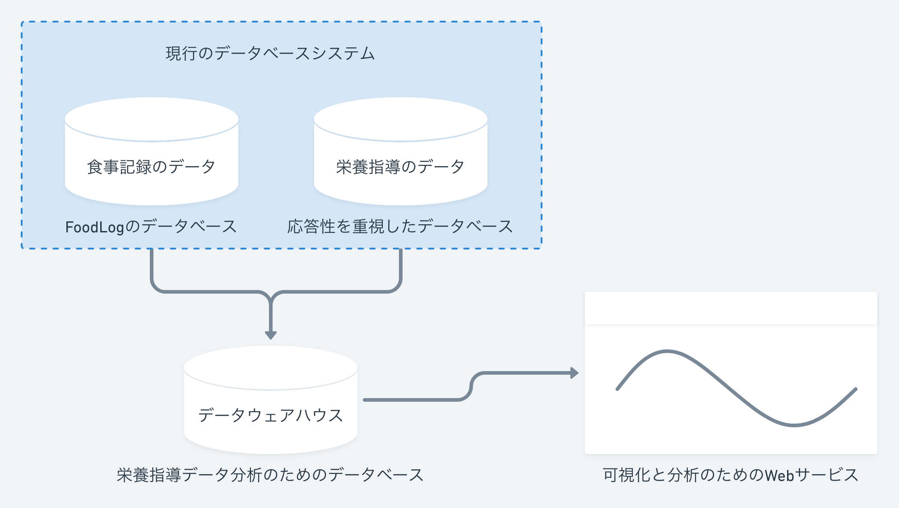

<!--
- 栄養情報の統計
- 栄養データの正確性
- サービスのオープン化
- 栄養指導データの収集
-->

<!-- transition: flip -->

# 課題と展望

---

## 1. 栄養情報の統計

<dl>
  <dt>現状</dt>
  <dd>
    <ul>
      <li>日毎のエネルギー・栄養素のまとめ</li>
      <li>日毎のPFCバランス (※ PFC: Protein / Fat / Carbs)</li>
    </ul>
  </dd>
  <dt>今後</dt>
  <dd>
    <ul>
      <li>栄養摂取量の変化の表示</li>
      <li>体組成値の変化の表示</li>
    </ul>
  </dd>
</dl>

<!--
---

## 2. 栄養データの正確性

<dl>
  <dt><strong>現状</strong></dt>
  <dd>
      2種類の栄養データベース 
    ・FoodLog (1500件) → 正確 👍 
    ・EatSmart (9万件) → 不正確 😔
  </dd>
  <dt>
    <strong>手段</strong>
  </dt>
  <dd>
    管理栄養士が補正できるようにする
  </dd>
</dl> -->

---

## 2. サービスのオープン化

<dl>
  <dt>現状</dt>
  <dd>利用者は関係者のみの数十人</dd>
  <dt>目的</dt>
  <dd>
    栄養指導データをデータセットとして利用するために、 
    サービスのオープン化によって<em>多くの人に使って貰いたい</em>
  </dd>
  <dt>手段</dt>
  <dd>
    組織やサービスを管理するためのコンソールを作成し、 
    <em>選手同士を比較</em>したり<em>組織としての入力率</em>を見せる
  </dd>
</dl>

---

## 3. 栄養指導データの収集

<figure>
  
  <figcaption>データを分析するためには分析のためのデータ集積所が必要</figcaption>
</figure>
